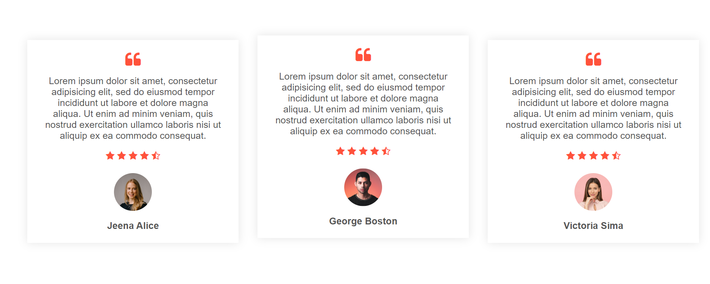

<h1 align="center">
   
  Online Clothing Store
   
</h1>

<h4 align="center">This is a pure HTML, CSS designed online clothing store with Account, Products, Cart, etc.</h4>

  
  
   
  <a href="#description">Description</a> 

## Description

